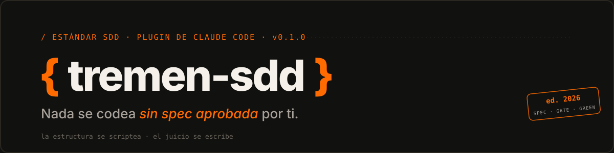

<p align="center">
  
</p>

# tremen-sdd

Plugin de Claude Code que empaqueta el estándar SDD (spec-driven development)
de tremen.dev: jerarquía épica → spec → tarea, "nada se codea sin spec
aprobada", ADRs inmutables y un pipeline de roles producto → arquitecto →
implementador → verificador — con hooks que lo hacen cumplir y scripts que
lo automatizan, en vez de dejarlo en prosa que cada proyecto reimplementa a
su manera.

**Documentación visual** (`site/`, con el design system de tremen.dev):

| Página | Qué cuenta |
|---|---|
| [`site/index.html`](site/index.html) | Qué es tremen-sdd, la filosofía y la instalación |
| [`site/equipo.html`](site/equipo.html) | **Este es tu equipo**: los 7 roles, como personas — qué hacen y a qué se niegan |
| [`site/flujos.html`](site/flujos.html) | **¿Cómo hago…?**: idea nueva, bug, feature, estado, "un hook me bloqueó", y la vida de una spec |

## Instalación

```bash
claude plugin marketplace add tremen-dev/tremen-sdd
claude plugin install tremen-sdd@tremen-sdd
```

(Verificado también con un marketplace local: `claude plugin marketplace add D:\ruta\a\tremen-sdd`.)

## Inicio rápido

```
/sdd-init          → estampa la estructura SDD en el proyecto (nuevo o migración)
/sdd-producto       → define la primera épica
                      (gate humano: aprobar épica/spec)
pipeline            → sdd-arquitecto (spec) → sdd-implementador (TDD) → sdd-verificador (GREEN/RED)
```

Los hooks son fail-open: no bloquean nada hasta que exista `.sdd.json` en la
raíz del proyecto (lo crea `/sdd-init`).

## Skills

| Skill | Rol |
|---|---|
| `sdd-orquestador` | Entrada y router de todo trabajo: clasifica la petición, localiza o encarga su spec y conduce el pipeline con sus gates humanos. |
| `sdd-producto` | Product Owner y guardián del roadmap: define o prioriza épicas, aclara visión y criterios de éxito. |
| `sdd-arquitecto` | Única autora de SPECs y ADRs: convierte una épica en spec testable o registra una decisión técnica. |
| `sdd-implementador` | Implementa una spec aprobada, CA a CA con TDD, y mantiene su mitad del ledger. |
| `sdd-verificador` | Gate adversarial: verifica la implementación contra los CA de la spec y emite GREEN/RED. Nunca edita código. |
| `sdd-documentalista` | Cierre mecánico del ciclo: regenera el tablero, valida artefactos y detecta drift docs↔código. Tier barato (haiku). |
| `sdd-como-vamos` | Informe read-only del estado del proyecto: qué espera al humano, qué está en curso o bloqueado. No escribe nada. |

## Comandos

| Comando | Qué hace |
|---|---|
| `/sdd-init` | Inicializa (modo nuevo) o migra (modo migración) un proyecto al estándar tremen-sdd. |
| `/sdd-tablero` | Regenera `docs/tablero.md` desde los frontmatters de los artefactos. |

## Máquina de estados

Definida en `scripts/estado.mjs` (`TRANSITIONS`) y es la única vía sancionada
para cambiar el estado de un artefacto (spec, épica, task):

```
borrador ──────► aprobada ──────► en-progreso ──────► en-revision ──────► hecho
   │                 │                  │                    │
   │                 │                  │                    └──► en-progreso (rechazo)
   └─────────────────┴──────────────────┴──────► bloqueada
                                                       │
                                     bloqueada ────────┴──► borrador | aprobada | en-progreso | en-revision

hecho es terminal (sin transiciones salientes).
```

Cada transición añade una entrada a `historial` en el frontmatter
(`{estado, fecha, por}`); `scripts/valida.mjs` comprueba que la última
entrada del historial coincide con el `estado` declarado.

## Hooks

| Hook | Evento | Qué hace |
|---|---|---|
| `require-spec.mjs` | `PreToolUse` (Edit\|Write\|MultiEdit) | Deniega editar código bajo `rutasVigiladas` si la rama actual no es `ft/SPEC-NNN-slug` o la spec no está `aprobada`/`en-progreso`. |
| `protege-verdad.mjs` | `PreToolUse` (Edit\|Write\|MultiEdit) | Deniega escribir a mano documentos generados (`docs/tablero.md`) o documentos de verdad (`FOUNDATION.md`, `docs/fundacion/`) fuera de sus dueños (`sdd-arquitecto`, `sdd-producto`, `main`). |
| `calidad.mjs` | `PostToolUse` (Edit\|Write\|MultiEdit) | Valida coherencia frontmatter/estado/historial de artefactos SDD, o lanza el linter del proyecto sobre código; `exit 2` devuelve el problema como feedback accionable. |

Los tres son **fail-open**: ante cualquier duda (fichero no vigilado,
`.sdd.json` ausente, linter no instalado...) permiten la operación en vez de
bloquear.

**Válvula de escape**: `SDD_SKIP_GATE=1` desactiva `require-spec.mjs` y
`protege-verdad.mjs` (no `calidad.mjs`, que solo informa). Uso puntual —
p. ej. depuración— nunca como hábito; `sdd-como-vamos` la reporta si la
detecta activa.

## Estructura que estampa `/sdd-init` en un proyecto

```
.sdd.json                  # config: idioma, rutasVigiladas, gates activos
FOUNDATION.md              # documento de verdad de alto nivel
CLAUDE.md                  # bloque tremen-sdd (no pisa un CLAUDE.md existente)
docs/
  roadmap.md
  tablero.md                # GENERADO — solo por scripts/tablero.mjs
  fundacion/
    vision.md
    dominio.md
    reglas.md
    contexto.md
  epicas/
    EPIC-NNN-slug/
      _epica.md
      SPEC-NNN-slug.md
      SPEC-NNN-slug.ledger.md
  adr/
    ADR-NNN-slug.md
```

Las plantillas de origen viven en `templates/` (`FOUNDATION.md`, `CLAUDE.md`,
`sdd.json`, `roadmap.md`, `fundacion/*`, `artefactos/{_epica,SPEC,SPEC.ledger,TASK,ADR}.md`)
y `templates/rol-dominio.md` para generar roles de dominio a demanda.

## Diseño

El diseño completo del estándar y del plugin —convenciones canónicas,
alternativas consideradas, alcance de la v1 y fases futuras— está en
[`docs/superpowers/specs/2026-07-09-tremen-sdd-design.md`](docs/superpowers/specs/2026-07-09-tremen-sdd-design.md).
